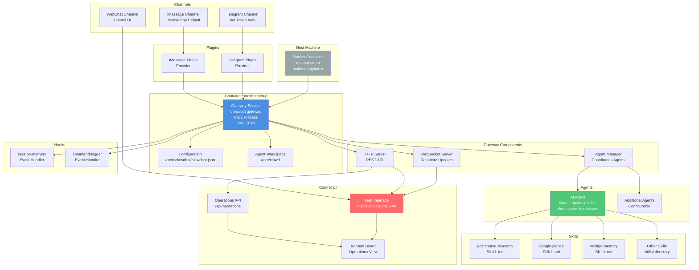
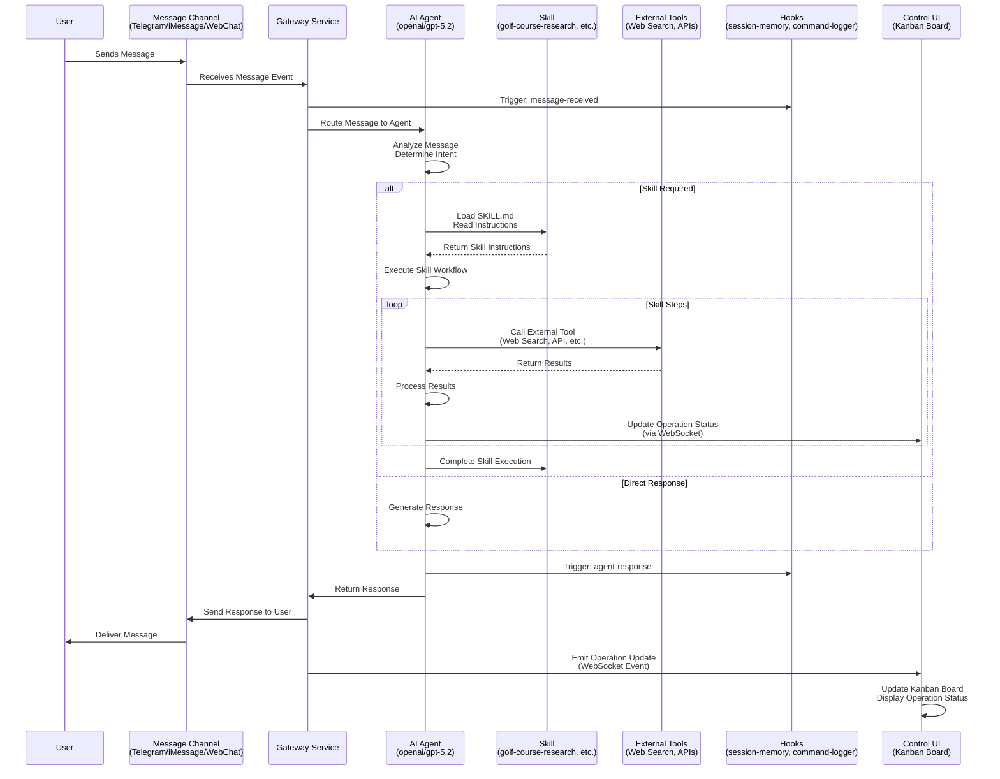
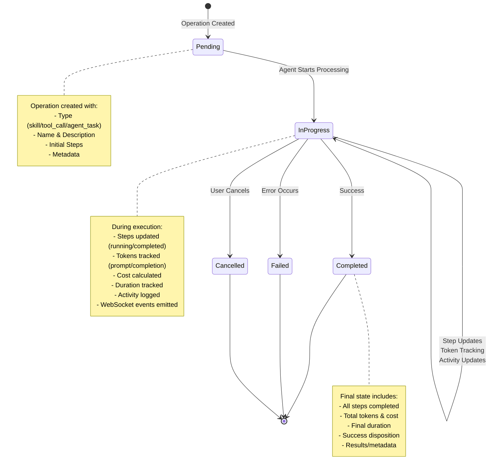
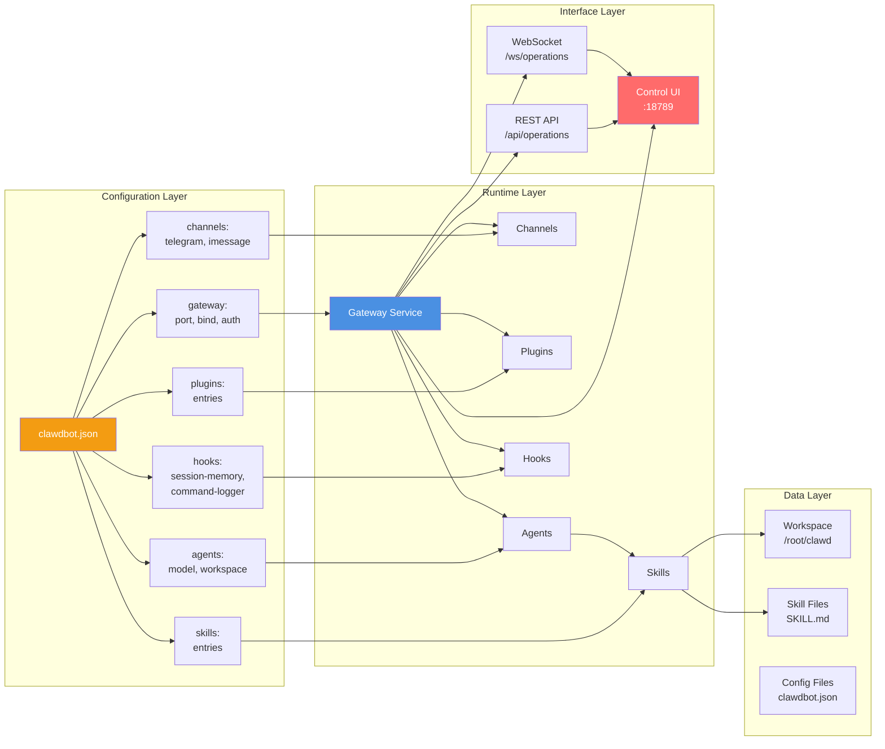
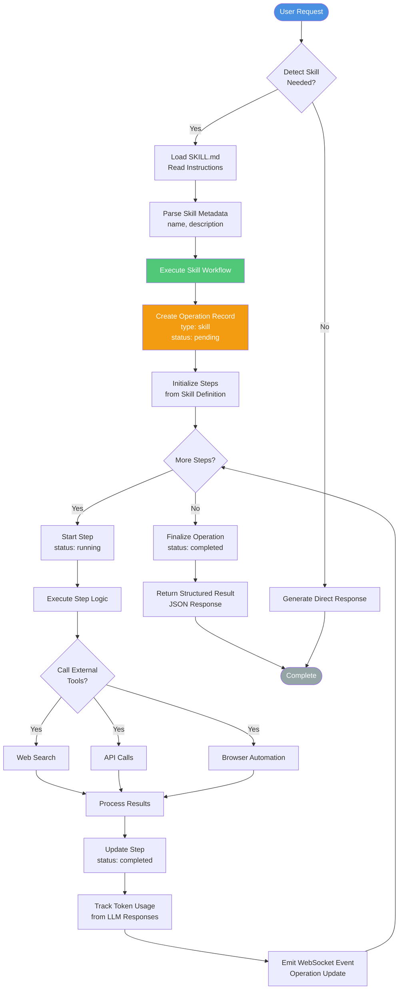

# Moltbot/Clawdbot Architecture & Workflows

This document provides comprehensive Mermaid diagrams to orient AI agents through the Moltbot/Clawdbot project architecture and workflows.

## System Architecture Overview



## Message Flow Architecture



## Operation Lifecycle



## Component Relationships



## Skill Execution Workflow



## Docker & Deployment Architecture

```mermaid
graph TB
    subgraph "Host Machine (macOS/Linux)"
        DockerHost[Docker Engine]
        PortMapping[Port Mapping<br/>127.0.0.1:18789:18789]
    end
    
    subgraph "Container: moltbot-setup"
        PID1[PID1 Process<br/>clawdbot gateway<br/>--port 18789<br/>--bind lan]
        
        subgraph "File System"
            ConfigFile[/root/.clawdbot/clawdbot.json]
            WorkspaceDir[/root/clawd/]
            SkillDir[/root/clawd/skills/]
        end
        
        subgraph "Network"
            ContainerPort[Port 18789<br/>LAN Binding]
        end
    end
    
    subgraph "External Access"
        Browser[Browser<br/>http://127.0.0.1:18789/]
        TelegramAPI[Telegram API<br/>Bot Token]
        DevicePairing[Device Pairing<br/>Token Auth]
    end
    
    DockerHost --> PortMapping
    PortMapping --> ContainerPort
    ContainerPort --> PID1
    
    PID1 --> ConfigFile
    PID1 --> WorkspaceDir
    PID1 --> SkillDir
    PID1 --> ContainerPort
    
    ContainerPort --> Browser
    ContainerPort --> DevicePairing
    PID1 --> TelegramAPI
    
    style PID1 fill:#4a90e2,color:#fff
    style DockerHost fill:#95a5a6,color:#fff
    style Browser fill:#ff6b6b,color:#fff
```

## Control UI Integration

```mermaid
graph TB
    subgraph "Gateway HTTP Server"
        RESTAPI[REST API Endpoints]
        WSServer[WebSocket Server]
        StaticFiles[Static File Server]
    end
    
    subgraph "Control UI Routes"
        Home[/ - Home/Dashboard]
        Operations[/operations - Kanban Board]
        Settings[/settings - Configuration]
    end
    
    subgraph "Kanban Board Components"
        Board[KanbanBoard.tsx<br/>Main Container]
        Column[KanbanColumn.tsx<br/>Status Columns]
        Card[OperationCard.tsx<br/>Operation Cards]
        Modal[OperationDetailModal.tsx<br/>Detail View]
    end
    
    subgraph "Data Layer"
        Hook[useOperations Hook<br/>Data Management]
        Service[operationService.ts<br/>API Client]
        Types[operation.ts<br/>TypeScript Types]
    end
    
    subgraph "Real-time Updates"
        WSConnection[WebSocket Connection<br/>ws://127.0.0.1:18789/ws/operations]
        Polling[Polling Fallback<br/>If WS Fails]
    end
    
    RESTAPI --> Service
    WSServer --> WSConnection
    StaticFiles --> Home
    StaticFiles --> Operations
    StaticFiles --> Settings
    
    Operations --> Board
    Board --> Column
    Column --> Card
    Card --> Modal
    
    Service --> Hook
    Hook --> Board
    WSConnection --> Hook
    Polling --> Hook
    
    Types --> Service
    Types --> Hook
    Types --> Card
    
    style RESTAPI fill:#4a90e2,color:#fff
    style Board fill:#50c878,color:#fff
    style WSConnection fill:#f39c12,color:#fff
```

## Key Workflows Summary

### 1. Message Processing Workflow
1. User sends message via Channel (Telegram/iMessage/WebChat)
2. Gateway receives message event
3. Hooks triggered (session-memory, command-logger)
4. Message routed to appropriate Agent
5. Agent analyzes intent and determines if Skill needed
6. If Skill required: Load SKILL.md, execute workflow
7. Agent generates response using LLM (openai/gpt-5.2)
8. Response sent back through Channel to User
9. Operation updates emitted via WebSocket to Control UI

### 2. Skill Execution Workflow
1. Agent detects need for Skill (auto-detect or manual)
2. Load SKILL.md file from workspace
3. Parse frontmatter (name, description)
4. Create Operation record (type: skill, status: pending)
5. Initialize steps from Skill definition
6. Execute each step:
   - Update step status (running → completed)
   - Call external tools (web search, APIs, Playwright)
   - Process results
   - Track token usage from LLM calls
   - Emit WebSocket updates
7. Finalize operation (status: completed)
8. Return structured result

### 3. Operation Tracking Workflow
1. Operation created when skill/tool/agent task starts
2. Operation record includes: type, name, steps, metadata
3. Steps updated as operation progresses
4. Token usage tracked from LLM API responses
5. Cost calculated based on token usage and model
6. Duration tracked from start to completion
7. WebSocket events emitted on each update
8. Control UI receives updates and displays in Kanban Board
9. Operation finalized with disposition (success/failure)

### 4. Configuration Management Workflow
1. Configuration stored in `/root/.clawdbot/clawdbot.json`
2. Gateway reads config on startup
3. Config sections: gateway, channels, plugins, skills, agents, hooks
4. Changes can be made via CLI: `clawdbot config set <path> <value>`
5. Gateway restart required for some config changes
6. Device pairing managed via `clawdbot devices approve`

## Key File Locations

- **Config**: `/root/.clawdbot/clawdbot.json` (inside container)
- **Workspace**: `/root/clawd` (inside container)
- **Skills**: `/root/clawd/skills/` or `skills_for_moltbot/` (project)
- **Control UI**: `ui/kanban-board/` (project)
- **Gateway**: Runs as PID1 in container
- **Port**: `127.0.0.1:18789` (host) → `18789` (container)

## Common Commands Reference

```bash
# Container Management
docker ps -a --filter "name=moltbot-setup"
docker start moltbot-setup
docker restart moltbot-setup
docker logs moltbot-setup

# Gateway Management
docker exec moltbot-setup clawdbot gateway status
docker exec moltbot-setup clawdbot gateway restart

# Configuration
docker exec moltbot-setup clawdbot config get <path>
docker exec moltbot-setup clawdbot config set <path> <value>

# Device Pairing
docker exec moltbot-setup clawdbot devices list
docker exec moltbot-setup clawdbot devices approve <request-id>

# Logs
docker exec moltbot-setup clawdbot logs
```

## Architecture Principles

1. **Gateway-Centric**: Gateway is the central service managing all connections
2. **Modular Skills**: Skills are self-contained packages with SKILL.md files
3. **Event-Driven**: Hooks provide event handling for extensibility
4. **Real-time Updates**: WebSocket provides live operation tracking
5. **Docker Isolation**: Containerized deployment for consistency
6. **Token-Based Auth**: Secure access via tokens and device pairing
7. **Workspace-Based**: Agents operate in isolated workspace directories
